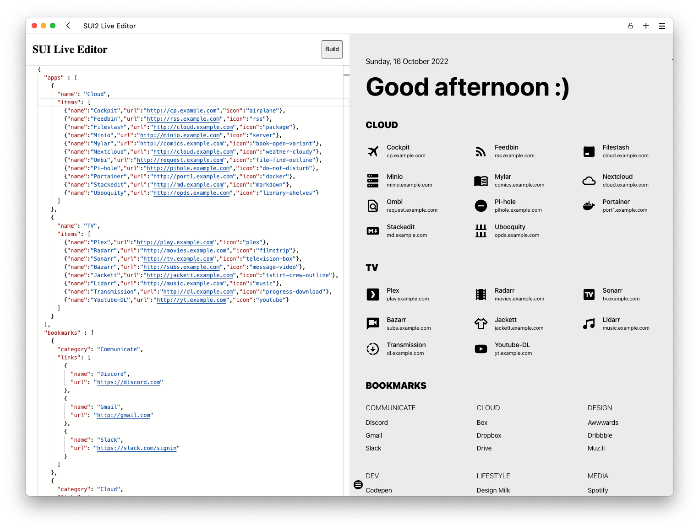

# SUI2

*a startpage for your server and / or new tab page*

Originally forked from [sui](https://github.com/jeroenpardon/sui), sui2 adds
new features like keyboard navigation and PWA to boost your productivity.
It's a complete refactor, brings new technologies for easier development & deployment.

See how keyboard navigation works in action:

<video src="https://user-images.githubusercontent.com/405972/193420471-7454270e-7bcc-43cc-a61d-e8b65e6b09f3.mov"></video>


## Deploy to any static hosting

sui2 uses Vite to build a staic website, which means it's nothing but vanilla HTML/CSS/JavaScript that could be deployed to anywhere you want.

To build the project, simply follow the steps below.

1. Install dependencies: `npm i`
2. Create you own `data.json`

   sui2 get all the data it requires from `data.json`, you can make a copy from `data.example.json`, and then edit it with your own applications and bookmarks.
3. Build the result: `npm run build`

   The result will be stored in the `dist` folder
4. Upload to a static hosting.

   There are various hosting services like GitHub Pages, Cloudflare Pages, Netlify.
   Examples will be documented later on.

If you are happy with the look and functionality of sui2, it is recommended to use this project as a submodule rather than fork it. Please checkout [reorx/start](https://github.com/reorx/start) as an example for how to use it in another project, and how to build with GitHub Actions and deploy to Cloudflare Pages.

## Deploy using Docker

> Notice: to make the preview page in live editor work more predictable, Docker image does not provide PWA support

sui2 provides a Docker image that runs a NodeJS server,
which not only servers the startpage directly,
but also gives you an interface to edit and build the startpage lively.



The image is hosted on Docker hub at: [reorx/sui2](https://hub.docker.com/r/reorx/sui2)

Run the following command to get started:

```bash
docker run --rm -t -p 3000:3000 -v data:/data reorx/sui2
```

Command explained:

- `-p 3000:3000`: the server runs on port 3000, you need to specify the port on host to expose, if you want to access it from 5000, you can change the argument to `-p 5000:3000`
- `-v data:/data`: you need to attach a volume to `/data`, which stores the config and static resources of the startpage

After the container is alive, open `http://DOCKER_HOST:3000/` to see the initial startpage.

For the live editor, open `http//DOCKER_HOST:3000/editor/`, there's no link for it on the startpage.

Checkout the configuration file [fly.toml](https://github.com/reorx/sui2/blob/master/fly.toml) as an example for how to deploy the Docker image to fly.io

### Build Docker Image

Currently, the image has only amd64 and arm64 variants, if your architecture is not one of these,
please build the image by yourself, simply by running:

```
docker buildx build -t sui2 .
```

Notice that BuildKit (buildx) must be used to get the `TARGETARCH` argument,
see [Automatic platform ARGs in the global scope](https://docs.docker.com/engine/reference/builder/#automatic-platform-args-in-the-global-scope)


## `data.json` editing

There's a full example in [data.example.json](https://github.com/reorx/sui2/blob/master/data.example.json),
it's self explanatory so I'm not going to write too much about it, maybe a json schema will be created as a supplement in the future.

The only thing worth mentioning here is the `icon` attribute,
it uses the [MDI icon set from Iconify](https://icon-sets.iconify.design/mdi/), you can find any icon you like in this page, and use the name after `mdi:` as the value for the `icon` attribute. For example `mdi:bread-slice` should be used as `"icon": "bread-slice"` in `data.json`.

## Development

Developing the startpage is easy, first clone the project, then run the following:

```bash
npm install

# start vite dev server
npm run dev
```

Developing the live-server is a little bit tricky, `live-server/` is an independent package with an express server and another vite frontend.

```bash
cd live-server
npm install

# start the express server on port 3000
npm run dev-backend

# open another shell, then start vite dev server
npm run dev
```

The output of `npm run dev` looks like this:

```
  ➜  Local:   http://localhost:5173/editor/
```

You can now open this URL to start developing live-server.
The fetch requests of `/api` and `/preview` on this page will be proxied to
the express server on port 3000. The default data folder is at `live-server/data/`.

## TODO

Some other features I plan to work in the future, PRs are welcome.

- [ ] Custom theme editor
- [ ] Support dynamically render the page from `data.json`. This makes it possible to host a sui2 distribution that is changable without the building tools.
- [ ] A chrome extension that shows sui2 in a popup.
- [ ] Add new tab support for the chrome extension.

## Donation

If you think this project is enjoyable to use, or saves some time,
consider giving me a cup of coffee :)

- [GitHub Sponsors - reorx](https://github.com/sponsors/reorx/)
- [Ko-Fi - reorx](https://ko-fi.com/reorx)
